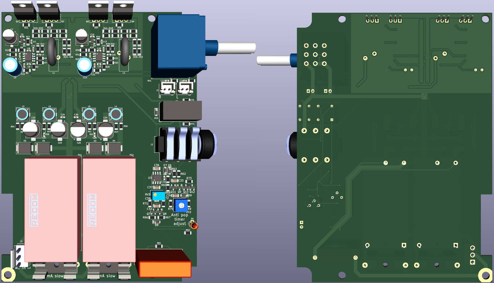

# X-Altra HPA-1
A compact high-power class A amplifier with a schematic from [this](https://www.diyaudio.com/community/threads/x-altra-hpa-1-class-a-headphone-amplifier.369499/) thread.
This design uses mostly SMT components with some THT. It is designed to fit in [this](https://item.taobao.com/item.htm?id=45818022688) case.

